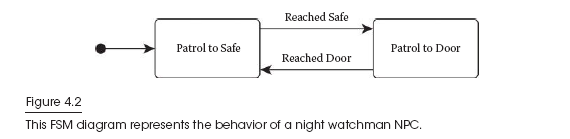
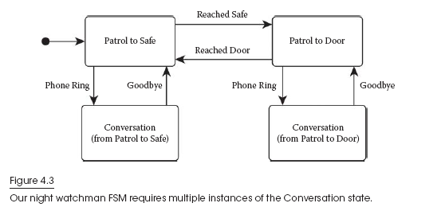
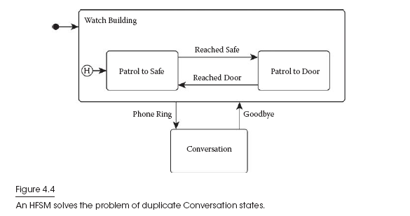

# 分层状态机

FSM是很有用,但它有缺点.从结构上来讲,将第二,第三或第四个状态添加到NPC上通常是微不足道的,因为所需要做的只是添加转换到几个现有的状态.但是,如果您接近开发的尽头并且FSM已经存在10、20或30个状态,那么将新状态添加到现有结构中将非常困难且容易出错.

在一些常见的模式下FSM没有很好的处理能力,例如重用行为.举一个例子,图4.2显示了一个守夜人NPC负责守卫建筑物的保险柜,

该NPC只会在门和保险柜之间不停巡逻.假设要添加一个名为“通话”的新状态,该状态允许我们的守夜人响应手机呼叫,暂停进行简短通话并返回.如果在打来电话时值班人员在巡逻到门口状态,那么我们希望他在通话结束后继续巡逻到门口状态.同样,如果他在电话铃响时处于巡逻到保险柜状态,则在退出通话后应该回到巡逻到保险柜状态.

因为我们需要在通话后知道要转换回哪个状态,所以每次我们想要重用该行为时我们不得不创建一个新的通话状态,如图4.3所示.

在这个简单的示例中,我们需要两种“通话”状态以实现所需的结果,而在更复杂的FSM中,我们可能需要更多的状态.每次我们想重用一个状态时,以这种方式添加其他状态都不是理想的选择.它导致状态和图形复杂性的爆炸式增长,使现有FSM更加难以理解,新状态变得更加困难且易于出错.

值得庆幸的是,有一种技术可以缓解其中的一些结构性问题：层次有限状态机（ HFSM）.**在HFSM中,每个单独的状态都可以成为一个完整的状态机.该技术有效地将一个状态机(FSM)分成按层次结构排列的多个状态(HFSM)**.

回到守夜人NPC的例子,如果我们将两个巡逻状态嵌套到一个名为Watch Building的状态机中,那么我们只需要通过一个通话状态来解决问题,如图4.4所示.

原因是因为HFSM结构增加了额外的滞后作用,这在FSM中不存在.对于标准FSM,我们始终可以假设状态机以其初始状态启动,但是HFSM中的嵌套状态机则不是这种情况.请注意,图4.4中带圆圈的“ H”指向“历史记录”状态.第一次进入嵌套的Watch Building状态机时,历史记录状态指示初始状态,但从那时起,它指示该状态机的最新活动状态.

我们的示例HFSM在Watch Building中开始（由实心圆圈和箭头指示）如前所述）,它选择“巡逻到保险柜”作为初始状态.如果我们的NPC到达保险柜则转换为“巡逻到门”,同时历史记录状态将切换为“巡逻到门”.如果此时NPC的电话响起,则我们的HFSM会退出“巡逻到门和Watch Building”,并转换为“通话”状态.通话结束后,HFSM将转换回Watch Building,然后巡逻到门（历史状态）,而不是巡逻到保险柜（初始状态）恢复.

您可以看到,此设置实现了我们的设计目标,而无需重复任何状态.**通常,HFSM对状态的布局能提供更多的结构上的控制,从而可以将较大的复杂行为分解为更小,更简单的部分**.

更新HFSM的算法类似于更新FSM,由于嵌套状态而增加了递归复杂性.伪代码的实现相当复杂,超出了本概述文章的范围.要获得可靠的详细实现,请参阅IanMillington和John Funge的《Artificial Intelligence for Games》一书中的5.3.9节.

FSM和HFSM是解决许多游戏AI程序员通常面临的问题的非常有用的算法.正如讨论的那样,使用FSM有很多优点,但是也有一些缺点. FSM的主要潜在缺点之一是,您所需的行为可能无法完美地适应结构. HFSM可以在某些情况下（但不是全部）帮助缓解这种压力.例如,如果FSM遭受“状态重用”的困扰,并且将每个状态连接到其他状态,并且此时HFSM没有帮助,则其他算法可能是更好的选择.

