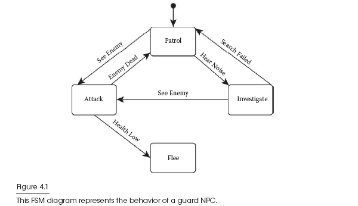

# <font color=#f05b72 >有限状态机</font>

有限状态机（FSM）是当今游戏AI编程中最常用的行为建模算法. FSM从概念上讲是简单且快速的代码,从而产生了功能强大且灵活的AI结构,而且其开销却很小.它直观且易于可视化,便于与技术水平较低的团队成员进行交流.每个游戏AI程序员都应该习惯使用FSM,并意识到它们的优缺点. **FSM将NPC的整体AI分解为较小的离散部分,称为状态.每个状态代表一种特定的行为或内部配置,并且一次仅将一个状态视为“活动”.**状态通过有向链路进行连接,这些过渡链路在满足某些条件时负责切换到新的活动状态. FSM的一项引人注目的功能是易于绘制和可视化.圆形框代表每个状态,连接两个框的箭头表示状态之间的转换.过渡箭头上的标签是该状态转换的必要条件.实心圆圈表示初始状态,即首次运行FSM时要输入的状态.例如,假设我们正在为保护城堡的NPC设计一个FSM,如图4.1所示.



我们的卫兵NPC从巡逻状态开始,在那里他遵循自己的路线,并密切注视着城堡的一部分.如果他听到杂音,那么他将离开巡逻,进行一下噪音调查然后再重新返回巡逻之前.如果在任何时候他看到敌人,他都会进入Attack来面对威胁.进攻时,如果他的健康值太低,他将逃亡.如果他击败了敌人,他将返回巡逻.尽管有许多可能的FSM实现,但查看该算法的示例实现很有帮助.

首先是FSMState类:

```C++
class FSMState
{
virtual void onEnter();
virtual void onUpdate();
virtual void onExit();
list<FSMTransition> transitions;
};
```

每个FSMState都有机会在三个不同的时间点执行逻辑：进入状态时,退出状态时以及状态激活时在没有触发任何转换的每次更新时(保持当前的状态不变). 每个状态还负责存储FSMTransition对象的列表,这些对象表示该状态的所有潜在转换.

```c++
class FSMTransition
{
virtual bool isValid();
virtual FSMState* getNextState();
virtual void onTransition();
}
```

图中的每个转换条件都从FSMTransition扩展. 满足此转换条件时,isValid（）函数的计算结果为true,而getNextState（）返回满足此转换条件时转换到的状态. onTransition（）函数提供了在转换触发时执行任何必要的行为逻辑的机会,类似于FSMState中的onEnter（）. 

最后是FiniteStateMachine类：

```c++
class FiniteStateMachine
{
void update();
list<FSMState> states;
FSMState* initialState;
FSMState* activeState;
}
```

FiniteStateMachine类包含FSM中所有状态的列表,以及初始状态和当前活动状态.它还包含核心update（）函数,该函数被调用每次更新,并负责运行我们的如下所示的行为算法：

> •在activeState.transtitions转换列表中的每个转换上调用isValid（）,直到isValid（）返回true或列表到头为止
> •如果找到有效的转换,则：
> 	•调用activeState.onExit（）
> 	•将activeState设置为ValidTransition.getNextState（）\ \满足的转换条件所指向的下一个状态
> 	•调用activeState.onEnter（）
> •如果找不到有效的过渡,则调用activeState.onUpdate（）

有了这个结构,就可以设置转换条件并填写onEnter（）,onUpdate（）,onExit（）和onTransition（）函数以产生所需的AI行为. 这些特定的实现完全取决于设计.例如说,我们的“攻击”状态触发了一些对话,“他在那里,就把他揪出来！” 在onEnter（）函数中,并使用onUpdate（）函数定期选择战术位置,进行掩护,向敌人开火等等. 攻击和巡逻之间的过渡可以触发一些其他对话：“消除威胁！” 在开始构写FSM之前,画一些如图4.1所示的图可能会有所帮助,以帮助定义状态的逻辑以及它们如何相互联系. 一旦理解了不同的状态和转换条件,就开始编写代码. FSM既灵活又强大,但是它只适用于工作原理和开发基本逻辑的思想一样时.